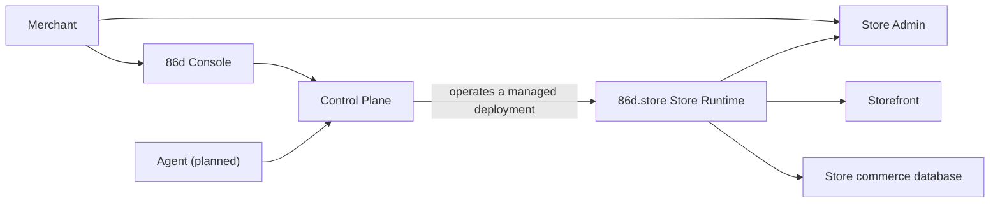

<Warning>
  **In development.** 86d is being built in the open. Every capability is Experimental until it earns evidence, so check [maturity levels](/resources/versioning) before you rely on anything here.
</Warning>

86d splits into two systems that own different facts. If you remember one sentence from this page: **86d.app operates your Store, and 86d.store owns your commerce data.** Nothing in the managed product ever becomes a second copy of your catalog or your [Orders](/concepts/commerce-model).

Four names get confused, so here they are side by side:

| Name | What it is |
| --- | --- |
| **86d.app** | The optional managed product |
| **86d Console** | The interface you sign in to at `console.86d.app` |
| **Control Plane** | The authority behind 86d.app. Not an interface |
| **[Store Admin](/concepts/admin)** | The merchant interface inside one Store Runtime |

86d Console asks for a managed operation. The Control Plane behind it decides whether you are allowed to do it, does it, and keeps the record.



## Who owns what

| Authority | Owns |
| --- | --- |
| **Control Plane** | 86d Accounts, Businesses, Members, Store records, provisioning, deployments, domains, 86d Cloud billing, and managed provider onboarding |
| **86d.store Store Runtime** | Catalog, [Inventory](/modules/inventory), content, [Cart](/modules/cart), [Checkout](/modules/checkout), [Orders](/modules/orders), [Payments](/modules/payments), [Customers](/modules/customers), [Fulfillment](/modules/fulfillment), [Shipping](/modules/shipping), notifications, [Loyalty](/modules/loyalty), and Store-scoped [Integrations](/concepts/connections) |

That split is why 86d can promise your data is portable. The Control Plane knows your Store exists, which plan it is on, and whether its deployment is healthy. It does not know what you sell.

Under the planned [Command](/concepts/agentic-design) model, each side also owns the audit record for the facts it changes. The Control Plane can coordinate work that crosses both, and the coordination record references the commerce record rather than copying it.

[How commerce records relate](/concepts/commerce-model) covers the Order, Payment, Fulfillment, and Shipping boundaries in detail.

## Standalone and managed

The same Store Runtime runs both ways:

| Mode | Who operates it | Provider credentials |
| --- | --- | --- |
| **Standalone** | You | Yours, in your server environment |
| **Managed** | 86d.app, through 86d Cloud | Managed capabilities the Control Plane supplies, plus any Connection you bring |

A standalone Store needs no [86d Account](/resources/glossary#86d-account) and makes no call to the Control Plane. Managed operation is still being built, so check [86d Cloud plans](/resources/cloud-plans) for the current state of the offer.

When a Store runs on 86d Cloud, it receives a [managed hostname](/resources/glossary#managed-hostname) derived from the Store name (`example.86d.store`, or `dev-example.86d.store` during development). Conflicts append a numeric suffix. You can still attach your own domain later; the managed hostname stays assigned.

## One Store, one database

Every Store Runtime is single-tenant: its own deployment, its own PostgreSQL database. Managed infrastructure may sit on shared provider accounts, but each Business and Store stays separately scoped and separately billed.

This is a deliberate cost. Multi-tenancy would be cheaper to operate and would make your data harder to leave with.

When a managed service genuinely needs an operational detail from a Store, a narrow Store-scoped projection can cross the boundary. The system receiving it does not become the authority for that fact.

## Inside a Store Runtime

The open-source repository is laid out like this:

```text
apps/store/       Storefront, Store Admin, and API routes
apps/registry/    Generated first-party Module manifest
modules/          101 first-party Modules
packages/         Runtime, CLI, database, auth, storage, SDK, shared code
templates/        Versioned MDX presentation packages
internals/        Code generators, Docker files, build tooling
```

A [Module](/concepts/modules) packages one or more [Features](/resources/glossary#feature) or [Integrations](/concepts/connections). [Storefront](/concepts/storefront) pages come from the active [Template](/concepts/templates). [Store Admin](/concepts/admin) collects the management pages that your enabled Modules register.

## How Modules talk to each other

**Current:** declared `requires` and `exports` contracts plus an in-memory event path. Module storage is compiled Postgres tables under `mod_<moduleId>`. Framework tables and `core.*` are owned by Drizzle.

**Target:** typed synchronous capability calls for immediate decisions, versioned events through a durable transactional outbox for everything afterward, and Postgres role isolation with column-projected published views for reads across Modules. Four framework tables (`core.party`, `core.subject`, `core.transaction`, `core.module_config`) hold cross-Module invariants; they exist in the schema but are not read by Modules in production yet.

That migration is happening one capability at a time and is not finished. Do not rely on durable cross-Module delivery or compiled table storage in production yet.

## Managed identity

A newly provisioned managed runtime receives three values together: `86D_STORE_ID`, `86D_API_URL`, and `86D_WORKLOAD_CREDENTIAL`. The runtime trades that opaque credential at a dedicated Control Plane endpoint for short-lived tokens scoped to one Store, one audience, and one set of capabilities.

The credential is rotatable and revocable, rotation allows only a bounded overlap, and revoking it stops new exchanges. It holds no provider secrets and is not a configuration bundle in disguise. Partial managed configuration fails closed: a configured managed runtime does not quietly fall back to a local Template when the Control Plane is unreachable.

Standalone Stores use `STORE_ID` for local data isolation and never call the Control Plane. Human sign-in to a managed Store Admin uses a separate pair, `86D_ADMIN_OAUTH_CLIENT_ID` and `86D_ADMIN_OAUTH_CLIENT_SECRET`. No machine credential can authenticate a person. See [environment variables](/configuration/environment-variables) and [authentication](/configuration/authentication).

## Provider boundaries

The planned provider model routes every operation through an explicit [Connection](/concepts/connections). Current Integrations still use provider-specific server configuration. When persistent Connection routing ships, each record keeps the Connection that produced it, and refunds, disputes, and webhooks return to that same relationship rather than falling over to another provider.

Provider secrets stay server-side. Browser input and agent output never become the authority for price, tax, Shipping, [Inventory](/modules/inventory), a Payment outcome, or Order state.

## Related pages

- [What is 86d?](/introduction)
- [How commerce records relate](/concepts/commerce-model)
- [How Connections route provider work](/concepts/connections)
- [How agents work with 86d](/concepts/agentic-design)
- [Glossary](/resources/glossary)
- [Versioning and maturity](/resources/versioning)
